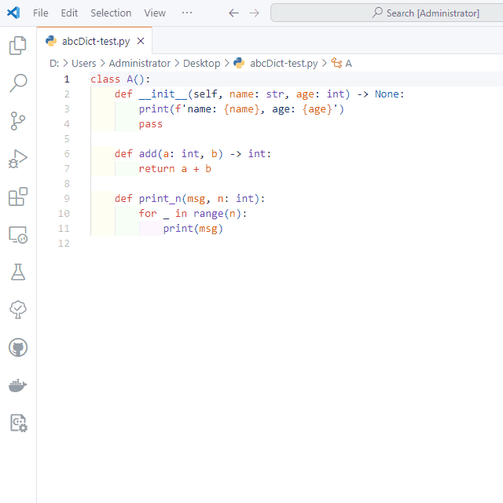

# abcDoc README

## python doc

**head** Type `head` on the first line (a blank line) and select the completion item.

**docs** On the line immediately following the class or method definition (a blank line), type docs at the beginning of the line and select the completion item.

